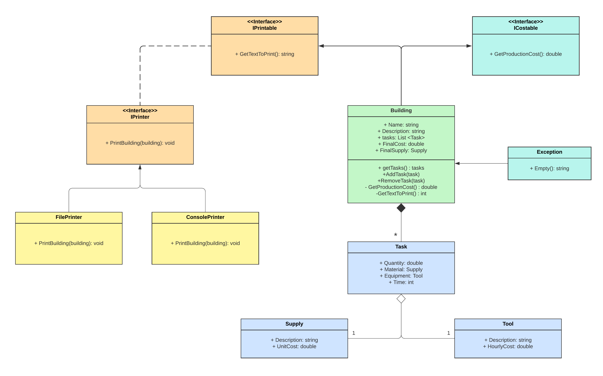

# PII Full GRASP and SOLID - Edificaciones



## Desafío1

➡️ Agregar la responsabilidad de calcular el costo total de producir un edificio:

```
double GetProductionCost()
```

El calculo de costo total es el siguiente:

Costo materiales = Sumatoria de costo unitario de los materiales,

Costo herramientas = Sumatoria de tiempo de uso x costo/hora del equipo para todos los pasos de la obra,

Costo total = costo materiales + costo herramientas

➡️ ¿Qué patrón o principio usan para asignar esta responsabilidad? Escriban la respuesta en comentarios en el código.

➡️ Agregar al final de la impresión de la edificación el costo total de producción que se obtiene usando el método recién agregado.

## Desafío 2
Para imprimir la información de un edificio, se necesita información del edificio pero también se necesita saber cómo y dónde imprimir.

➡️ Crear una clase ConsolePrinter para imprimir la información de los edificios en la consola en lugar que los edificios se impriman ellos mismos.

➡️ ¿Qué patrones o principios usan para determinar cómo implementar este cambio? Escriban la respuesta en comentarios en el código.

## Fundamentación de patrones y principios

En esta entrega se pudo ver claramente el uso del patrón Expert, particularmente en la clase Building, en donde se le asigno la responsabilidad de calcular el costo de la producción. Esto se realizó ya que es la clase experta en esta información.
```
public double GetProductionCost()
        {
            double materialCost = 0;   /// Costo de materiales
            double toolCost = 0;       /// Costo de herramientas
            
            foreach (Task task in this.tasks)
            {
                materialCost += task.Material.UnitCost * task.Quantity;
                toolCost += task.Equipment.HourlyCost * task.Time;
            }
            double totalCost = materialCost + toolCost;
            return totalCost;
        }
```
Por otro lado, el principio de resposabilidad única se vió reflejado tanto en la clase Building como en la nueva que creamos, Printer. En la clase Building se quitó el método para imprimir en consola
```
PrintBuilding()
```
En consecuencia, se le asignó esta responsabilidad a la nueva clase Printer. Esto nos permité (de ser necesario) cambiar el método y su funcionamiento desde esa misma clase y no teniendo que cambiar siempre la clase Building.
```
public class Printer
    {
        public void PrintBuilding (Building building)
        {
            Console.WriteLine($"Edificio: {building.Description}");
            foreach (Task task in building.getTasks())
            {
                Console.WriteLine($"{task.Quantity} de '{task.Material.Description}' " +
                    $"usando '{task.Equipment.Description}' durante {task.Time}");
            }
            Console.WriteLine($"El costo es de: ${building.GetProductionCost()}");
        }
    }
```
## Test realizados
➡️ ProductionCostTest : Testea nuestro método GetProductionCost()
➡️ DescriptionTest:  Testea si la descripción es la correcta (para no testear todos los datos)
➡️ TaskTest  : Testea las tasks
➡️ FinalSupply: Testea el supply final (null)
➡️ ExceptionTest: Testea la excepción que creamos


